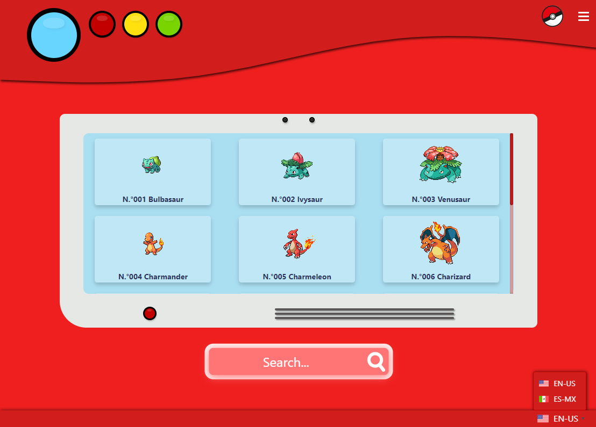

# Pokémon Safari & Pokédex

Pokémon Safari and Pokédex developed with React, Redux and Express.
Gotta Catch 'Em All!

[Live Demo](http://35.188.101.176:3001/)

## Pre-requisites

You must create a **.env** file on the root folder following the **.env-example** file.
The file just contains the PORT for running the Application and the Environment we
want to use (development or production).
> **Note:** The suggested PORT for the **.env** file is the **3001**, if you decide to take a different PORT, consider to update it on the **cypress.json** file on the baseUrl key.

## How It Works?

Require Node.JS

* `npm install` For instailling dependencies.
* `npm run lint` For verifying ESLint rules.
* `npm run build` For creating productionn files on the public output path.
* `npm run start:dev` For running SSR Application on development environment.
> **Note:** the .env file must have **development** as NODE_ENV value.
* `npm run start:prod` For running SSR Application on production environment.
> **Note:** the .env file must have **production** as NODE_ENV value.
* `npm run cypress:open` For opening Cypress Application with the available tests.
* `npm run test:ssr` For building the SSR Application, running the development environment and opening the Cypress Application in order to run the tests availables.
> **Note:** the .env and cypress files must have the **same PORT** specified.

You can test the [Backend](https://pokemon-simple-api.now.sh/api/pokemons/) on the following URL
https://pokemon-simple-api.now.sh/api/pokemons/

## Author & Credits

- [William Velazquez](https://twitter.com/@WilliamVlazquez)

## Social Networks

- [Website](https://williamvelazquez.com/)
- [Twitter](https://twitter.com/@WilliamVlazquez)
- [GitHub](https://github.com/WilliamVelazquez)
- [LinkedIn](https://www.linkedin.com/in/williamvelazquez/)
- [E-mail](mailto:info@williamvelazquez.com)

## License

MIT

## Screenshots

