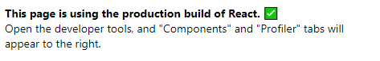

# Pokémon Safari & Pokédex

Pokémon Safari and Pokédex developed with React, Redux and Express.
Gotta Catch 'Em All!

[Live Demo](http://35.224.28.63:3001/)


## Functionality and Technologies

- **HTML, CSS & JS**
  Creating all the layout, styles of each element and some animations/interactions 
  (Like the **Intersection Observer** on the Pokédex while scrolling for more Pokémon
  limited to the 151 Pokémon (Just as Classic Pokédex), if you want to see other Pokémon 
  all of them are available and you can search them on the box!).

- **NodeJs & Express**
  Creating a **Backend** to serve the Pokémon data, handling **requests** to the server 
  (In order to hide the real API URL, just my Endpoints are visible).

  Creating First Render Content from the **Server Side** for better UX, SEO and Performance.

- **React**
  User interface library to create reactive and reusable componentes.

- **React Router**
  Handling the available and unavailable routes (Look at Safari Route that respond with a Not Found).

- ***Redux**
  Handling the application state and the data that will be shared between the components.
  (The Pokémon loaded on the Pokédex List should not need to request again their data even when visiting
  a different route and returning).

- **Webpack**
  Creating different staging environments (**Development & Production**), **Bundling** all the packages and handling
  a server side approach. (Splitting code on vendors and app code).

- **Cypress**
  Creating End To End Tests to verify the user application flows and interactions.

- **Mocha and NYC**
  Creating Tests for the Routes of the Backend and creating a coverage report.

- **i18next**
  Adding **Multi-Language** applications support (You can switch the language selecting a Flag!).
  
- **ESLint**
  Handling Code Analysis to Prevent Errors and Define a code writting style.
  
- **Google Cloud Platform & Now**
  **Cloud Platforms** that **Deploy** instantly, scale automatically, and requires no supervision at all, with **minimum configuration**.

## Pre-requisites

You must create a **.env** file on the root folder following the **.env-example** file.
The file just contains the PORT for running the Application and the Environment you
want to use (development or production).
> **Note:** The suggested **PORT** for the **.env** file is the **3001**, if you decide to take a different PORT, consider to update it on the **cypress.json** file on the **baseUrl** key.

## How It Works?

Require Node.JS

* `npm install` For instailling dependencies.
* `npm run lint` For verifying ESLint rules.
* `npm run build` For creating productionn files on the public output path.
* `npm run start:dev` For running SSR Application on development environment.
> **Note:** the .env file must have **development** as NODE_ENV value.
* `npm run start` For running SSR Application on production environment.
> **Note:** the .env file must have **production** as NODE_ENV value.
* `npm run cypress:open` For opening Cypress Application with the available tests.
* `npm run test:ssr` For building the SSR Application, running the development environment and opening the Cypress Application in order to run the tests availables.
> **Note:** The .env and cypress files must have the **same PORT** specified.

You can test the [Backend](https://pokemon-simple-api.now.sh/api/pokemons/) on the following URL
https://pokemon-simple-api.now.sh/api/pokemons/

## Steps to run the Project locally

1) Fork/Download/Clone the Project.

2) On the Project Folder install the dependencies running on your terminal:
```
npm install 
```
3) On the root Folder create the file **.env** with the following inside
For Development Environment:
```
PORT=3001
NODE_ENV=development
```
For Production Environment:
```
PORT=3001
NODE_ENV=production
```
4)Run the Project locally running on your terminal
For Development Environment:
```
npm run start:dev
```
For Production Environment:
```
npm run start
```
5) Open your preferred Browser at the following URL:
**http://localhost:3001/**
> **Note:** The URL must end with the **same PORT** specified inside the **.env** file.

## Author & Credits

- [William Velazquez](https://twitter.com/@WilliamVlazquez)

## Social Networks

- [Website](https://williamvelazquez.com/)
- [Twitter](https://twitter.com/@WilliamVlazquez)
- [GitHub](https://github.com/WilliamVelazquez)
- [LinkedIn](https://www.linkedin.com/in/williamvelazquez/)
- [E-mail](mailto:info@williamvelazquez.com)

## License

MIT

## Screenshots





